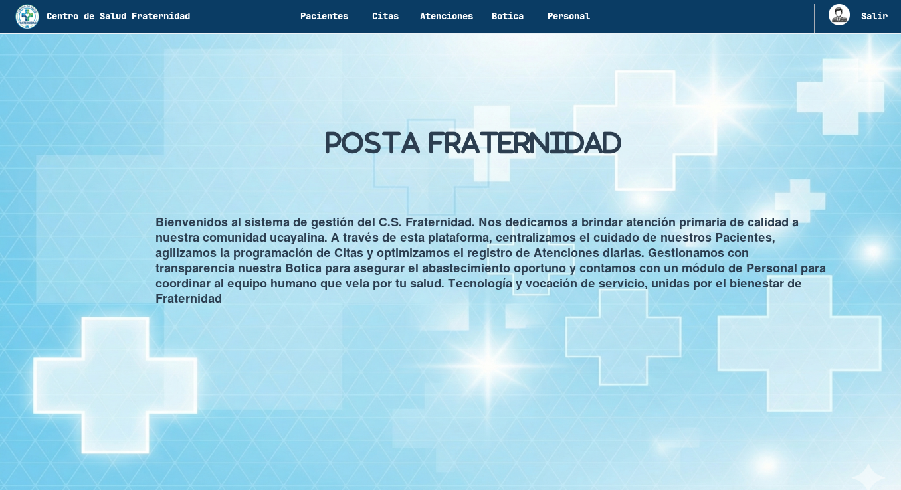
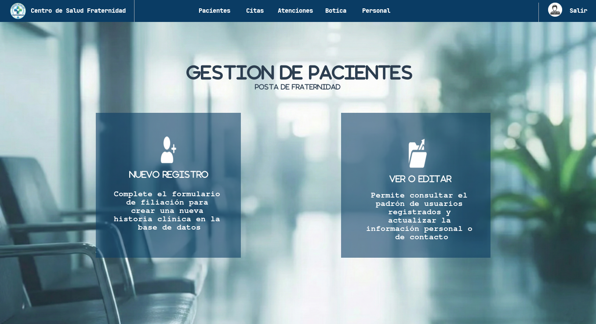
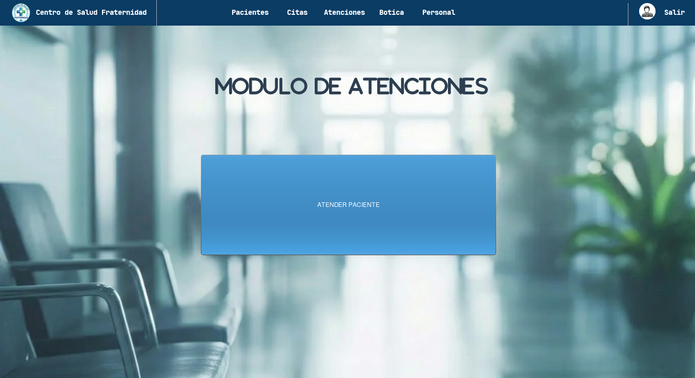
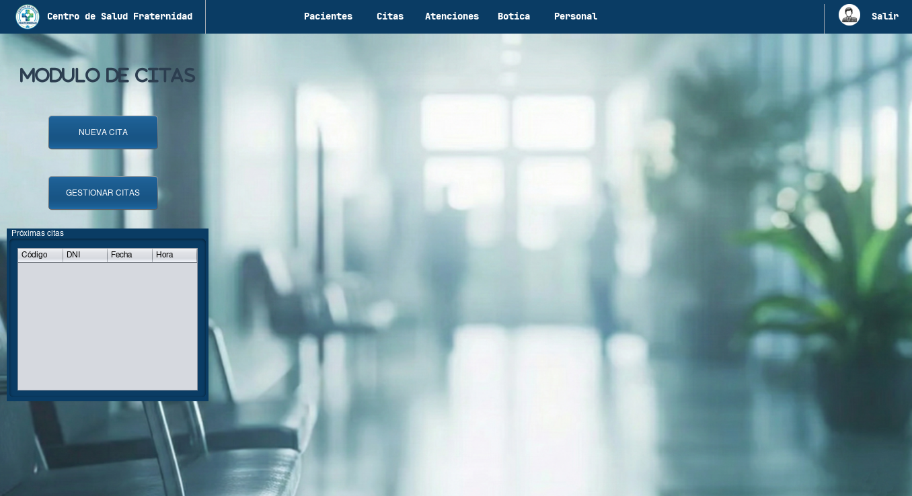
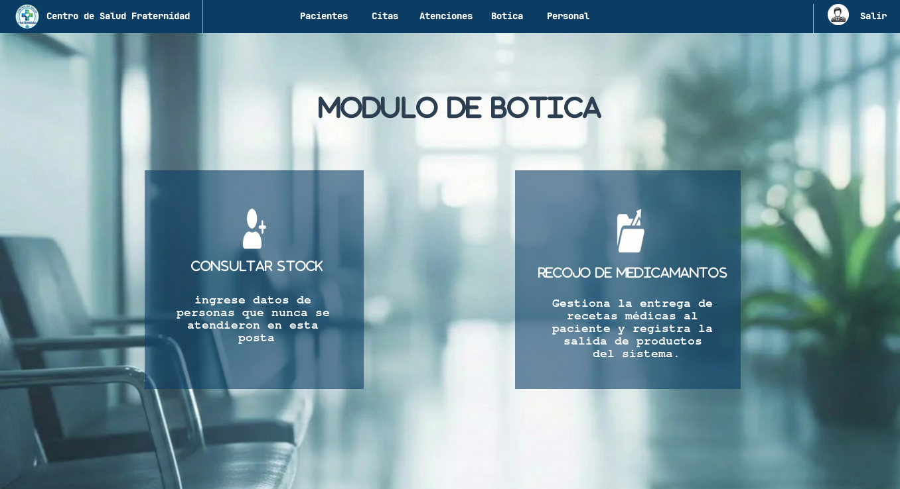
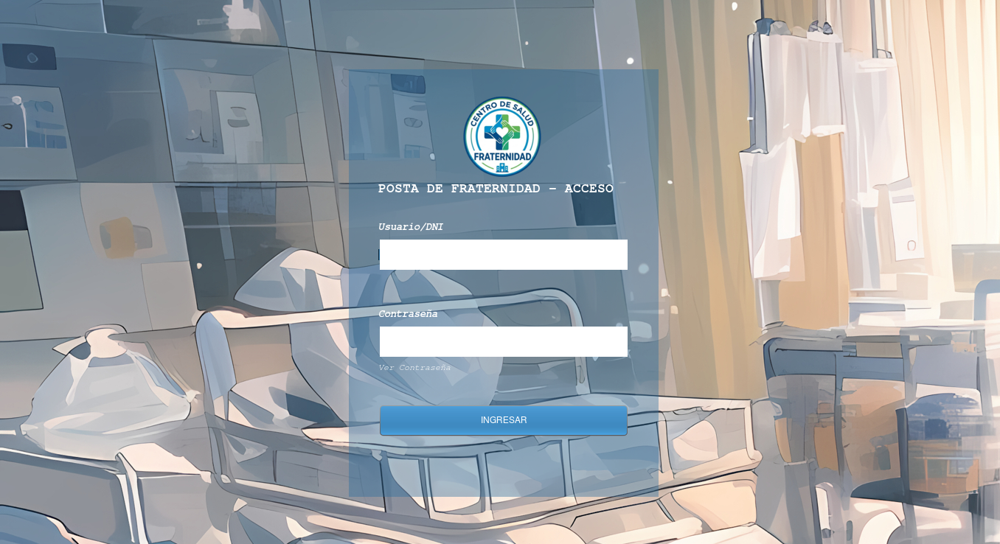

<h1 align="center">🏥 Sistema de Gestión - Posta de Salud "Fraternidad"</h1>

  

  <b>Sistema de escritorio para la administración de historias clínicas y atención médica en Pucallpa, Perú.</b>

## 📄 Descripción del Proyecto

Este software ha sido desarrollado en **Java (Swing)** para modernizar y agilizar los procesos de la **Posta Médica "Fraternidad"** ubicada en la ciudad de Pucallpa. 

El objetivo principal es reducir el uso de papel, evitar la pérdida de historias clínicas y optimizar el flujo de atención desde que el paciente llega hasta que recibe sus medicamentos. El sistema cuenta con una interfaz intuitiva diseñada pensando en la rapidez que requiere el personal médico y administrativo.

## 🚀 Módulos del Sistema

El sistema está dividido en 5 módulos fundamentales para la operación de la posta:

<table align="center">
  <tr>
    <td align="center" width="50%">
      <h3>1. Módulo de Pacientes</h3>
      
Registro de nuevos pacientes, edición de datos y visualización de historial.

      
    </td>
    <td align="center" width="50%">
      <h3>2. Módulo de Atenciones</h3>
      
Gestión del triaje y consulta médica en tiempo real.

      
    </td>
  </tr>
  <tr>
    <td align="center" width="50%">
      <h3>3. Módulo de Citas</h3>
      
Programación de turnos y calendario médico.

      
    </td>
    <td align="center" width="50%">
      <h3>4. Módulo de Botica</h3>
      
Control de stock de medicamentos y entrega de recetas.

      
    </td>
  </tr>
</table>

  <h3>5. Login del sistema  </h3>
  
Panel inicial para loguear un usuario y activar funciones dependiendo de su roll.

  

## 🛠️ Tecnologías Usadas
* **Lenguaje:** Java (JDK 17+)
* **Interfaz:** Java Swing
* **Base de Datos:** Ninguna
* **IDE:** NetBeans

---

  Desarrollado por Grupo 5 - Pucallpa, 2026

